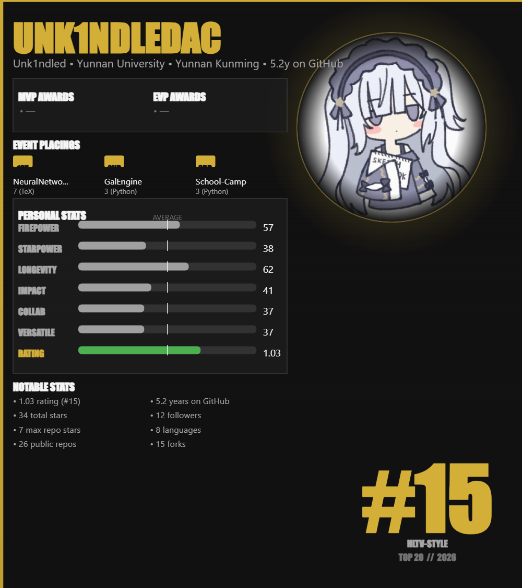
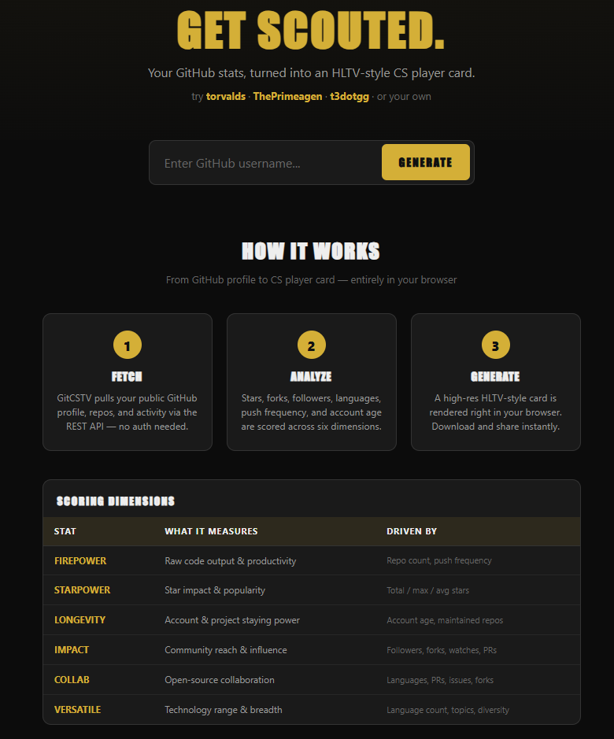
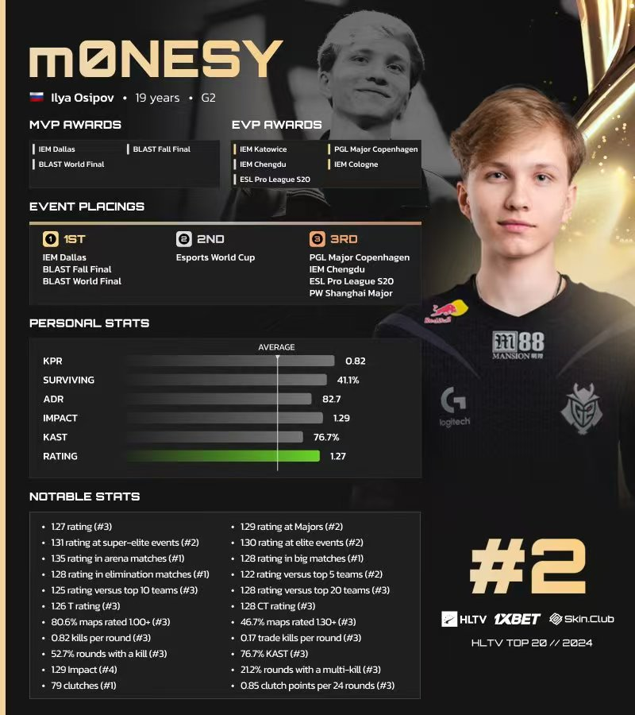

# GitCSTV

Turn your GitHub stats into a HLTV-style CS player card.

<p style="text-align: center;">
  
  
  
</p>

## How it works

1. **Fetch** — pulls your public GitHub profile, repositories, and recent activity via the REST API.
2. **Analyze** — scores six dimensions (Firepower, Starpower, Longevity, Impact, Collaboration, Versatility) using log-scaled GitHub metrics.
3. **Generate** — renders an 800×900 HLTV-style player card with your avatar, gray stats bars, a green Rating bar, MVP/EVP awards, event placings, and rank.

## Quick start

```bash
pip install -r requirements.txt
python main.py <github_username>
```

Example:

```bash
python main.py torvalds
```

Offline demo (no network required):

```bash
python main.py --demo -o demo_card.png
```

## Web app

```bash
python app.py
```

Open `http://localhost:5090` in your browser, enter a GitHub username, and generate your card.

## Options

| Argument         | Description                          |
|------------------|--------------------------------------|
| `-o, --output`   | Output image path (default: card.png)|
| `-t, --token`    | GitHub personal access token         |
| `--demo`         | Generate a sample card offline       |

The `GITHUB_TOKEN` environment variable is also recognized.

## Scoring dimensions

| Stat       | What it measures                  | Driven by                           |
|------------|-----------------------------------|-------------------------------------|
| FIREPOWER  | Raw code output & productivity    | Repos, push frequency, creation events |
| STARPOWER  | Star impact & project popularity  | Total / max / average stars per repo   |
| LONGEVITY  | Account & project staying power   | Account age, repo maintenance ratio    |
| IMPACT     | Community reach & influence       | Followers, forks, watch events, PRs    |
| COLLAB     | Open-source collaboration         | Language diversity, PRs, issues, forks |
| VERSATILE  | Technology range & breadth        | Language count, topics, repo diversity |

## Awards & events

| Label  | Criteria                          |
|--------|-----------------------------------|
| MVP    | Repository with >= 1,000 stars    |
| EVP    | Repository with >= 100 stars      |
| 1ST    | Top repo by star count            |
| 2ND/3RD| Second / third most starred repos |

## Project structure

```
gitcstv/
├── main.py             # CLI entry point
├── app.py              # Flask web server
├── github_client.py    # GitHub API data fetching
├── scoring.py          # GitFut-style scoring engine
├── card_generator.py   # Pillow card rendering
├── requirements.txt
├── templates/
│   └── index.html      # Web interface
└── README.md
```

## Disclaimer

Not affiliated with or endorsed by HLTV.org. "HLTV-style" refers to the visual card layout inspired by professional CS:GO player statistics. All card designs use publicly available GitHub data.

## License

MIT
